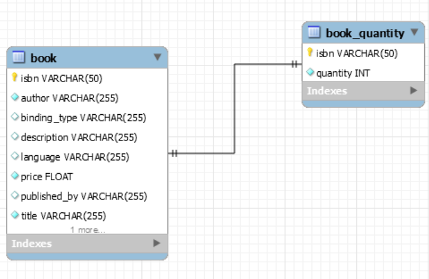

# Book Store
Book store web service responsible for managing and ordering books online 

To implement Rest API, following have been used : 
1. Spring boot
2. Spring-data-jpa
3. Mysql database for storing and managing the RD
4. Swagger.io for API documentation

# Entity-Relational Diagram


# STEPS TO RUN APPLICATION WITH DOCKER
1. On the project base directory, run following commands : 
````
mvn clean install
````
````
docker-compose up
````
It will run the following 2 services : 
1. docker-mysql : A container running MySql server available on 3306
2. book-store-app : A container runnig the spring boot application on 8080


# STEPS TO RUN APPLICATION MANUALLY( Without DOCKER)

Prerequisite :
1. JAVA 8
2. Mysql Server

Steps to install : 

1. update application.properties with the mysql database url and credentials.
2. In mysql create database schema using command : 

```
CREATE DATABASE bookstore
mysql -u username -p password bookstore < {project-base-location}/sqldump/bookstoreSchemaDump.sql
```
Alternatively, use Mysql Workbench for the same.
3. Build the project using maven command :
`mvn clean intall`

4. Run the application using java command: 

````
java -jar target/book-store-0.0.1-SNAPSHOT.jar --server.port=PORT
````
OR ( For port 8080)
````
java -jar target/book-store-0.0.1-SNAPSHOT.jar 
````
   
For example
````
java -jar target/book-store-0.0.1-SNAPSHOT.jar --server.port=8086 
````
5. One the application is up and running ,  the documentation for the RestAPI methods can be availed here : 
http://localhost:8080/swagger-ui.html
